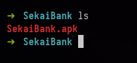
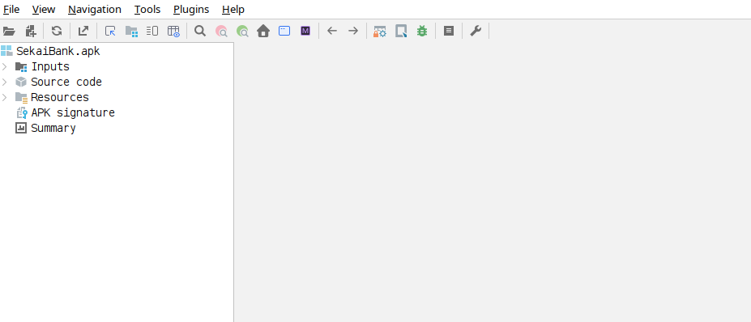
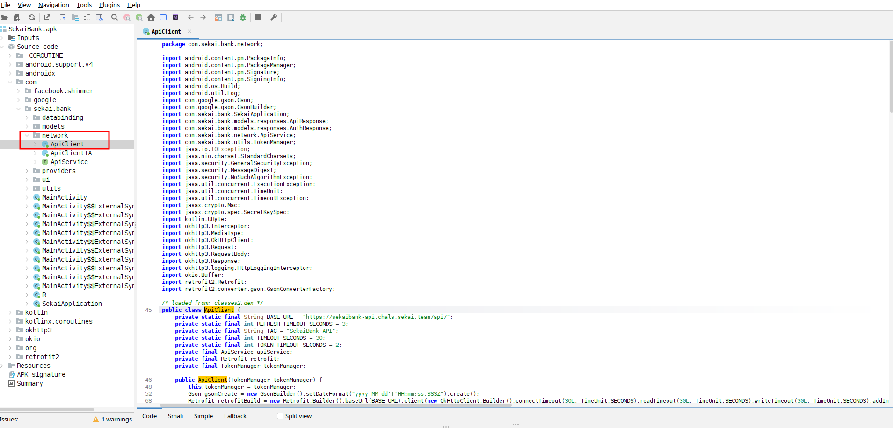
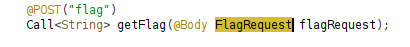
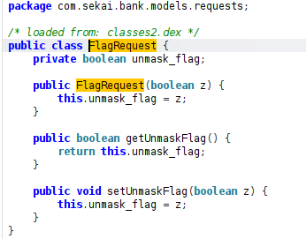
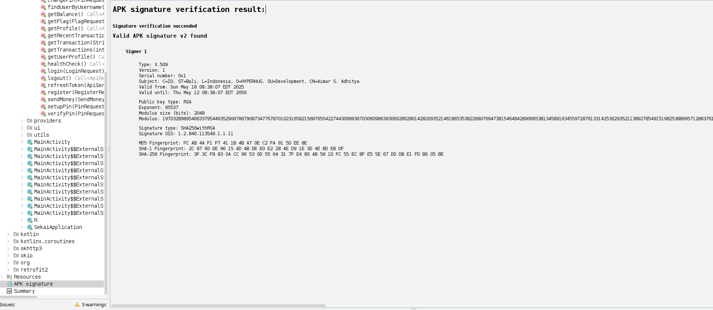
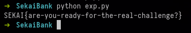

# SekaiBank Signature - Sekai Ctf

## Challenge Description
```

Let me introduce you to Sekai Bank!

```

After downloading the challenge, we get an **APK file**:



I could have used `apktool`, but since we need to analyze the code in depth, I opted for **jadx-gui**:



Browsing the files, the part that immediately caught my attention was **`network/ApiClient`**:



### Key Observations

The `ApiClient` communicates with:

```

https://sekaibank-api.chals.sekai.team/api/

````

It adds an **`X-Signature` header** using an HMAC:

```java
private String calculateHMAC(String str, byte[] bArr) throws IllegalStateException, GeneralSecurityException {
    Mac mac = Mac.getInstance("HmacSHA256");
    mac.init(new SecretKeySpec(bArr, "HmacSHA256"));
````

The key for the HMAC is derived from the APK's signing certificate:

```java
MessageDigest messageDigest = MessageDigest.getInstance("SHA-256");
for (Signature signature : signingCertificateHistory) {
    messageDigest.update(signature.toByteArray());
}
return calculateHMAC(str, messageDigest.digest());
```

The signature is calculated over:

```java
String str = request.method() + "/api".concat(getEndpointPath(request)) + getRequestBodyAsString(request);
```

In short:

* HMAC key = SHA-256 of APK signature
* Message = `METHOD + /api + PATH + BODY`
* Header = `X-Signature: <HMAC>`

---

### Discovering the Flag Endpoint

The API contains a `/api/flag` endpoint:



The request object:



We need to call `/api/flag` with `"unmask_flag": true`.

The SHA-256 signature can be extracted from the APK automatically by jadx:



---

### Automating the Request

Python script to generate the HMAC and retrieve the flag:

```python
import requests
import hmac
import hashlib
import json

def gerar_signature(secret_key_hex, method, path, body_dict):
    body_json = json.dumps(body_dict, separators=(',', ':'))
    mensagem = method + "/api" + path + body_json
    assinatura = hmac.new(bytes.fromhex(secret_key_hex), mensagem.encode("utf-8"), hashlib.sha256).hexdigest()
    return assinatura, body_json

Signature = "3f3cf8830acc96530d5564317fe480ab581dfc55ec8fe55e67dddbe1fdb605be"
method = "POST"
path = "/flag"
body = {"unmask_flag": True}

hmac_criado, body_json = gerar_signature(Signature, method, path, body)

headers = {
    "Content-Type": "application/json",
    "X-Signature": hmac_criado
}

req = requests.post("https://sekaibank-api.chals.sekai.team/api/flag", headers=headers, data=body_json)

print(req.text)
```

---

### Flag Retrieved



```
SEKAI{are-you-ready-for-the-real-challenge?}
```